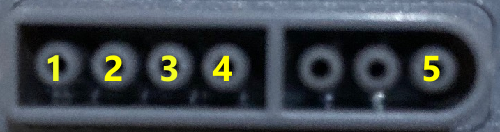

# pico-snes-controller

This is a very simple project that reads input from a Super Nintendo
controller with the Raspberry Pi Pico.

For optimal performance, we use the PIO. Reading all 12 buttons takes
a minimum of 162 microseconds.  With this code you can command the PIO
to read the controller status and get the result later at any point
without ever spending any CPU cycles to do the work.

## Physical Controller Connection

You need a way to access the wires in your controller's cable -- I
bought a cheap extension cord to destroy, but feel free to desecrate
your controller if you want.

In any case, here are the connections you'll need to make:



| SNES controller pin  | Function     | Pico pin     |
|---------------------:|--------------|-------------:|
| 1                    | 3.3V         | 3.3V out     |
| 2                    | Clock        | 12           |
| 3                    | Latch        | 13           |
| 4                    | Data         | 11           |
| 5                    | Ground       | Any ground   |

The Pico pins are just suggestions (which I used in the example in
`main.c`), the only limitation is that the latch pin must be the next
in sequence after clock (due to how the PIO works).

## Code

The code is very simple, you need to setup the PIO by calling:

```c
snes_controller_init(pio0, CLOCK_PIN, DATA_PIN);
```

The latch pin is assumed to be the next in sequence after clock.

After initialization, you can read the controller state at any point with:

```c
uint16_t data = snes_controller_read();
```

This will take at least 162 microseconds (without counting any
overhead). If that's too much waiting, you can trigger a read with

```c
snes_controller_read_start();
```

and later read the result with

```c
    uint16_t data = snes_controller_read_result();
```

The 12 lower bits of the data will contain the button states, where 0
means pressed (so `0xfff` means no button is being pressed).  The
buttons appear in the bits in the following order:

| Bit  | Button      |
|-----:|-------------|
| 0    | B           |
| 0    | Y           |
| 0    | SELECT      |
| 0    | START       |
| 0    | UP          |
| 0    | DOWN        |
| 0    | LEFT        |
| 0    | RIGHT       |
| 0    | A           |
| 0    | X           |
| 0    | L           |
| 0    | R           |

## License

The code is licensed under the MIT License.
